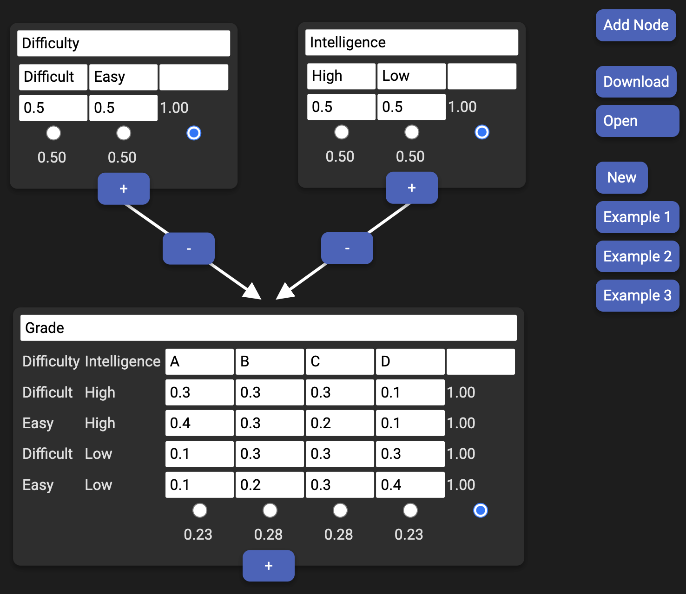

# Bayes Network Tool

This is a simple tool written in `React` to explore the properties of Bayesian Networks.

[Bayes Network Tool hosted on Github Pages](https://tobiasjacob.github.io/bayes-network/)

## Screenshot

[
    
](https://tobiasjacob.github.io/bayes-network/)

## Development

[
    
](https://vscode.dev/github/TobiasJacob/bayes-network)


```console
npm install
npm run serve
```

## Deployment

```console
npm run build
git commit -m "Deployment"
git push
```
